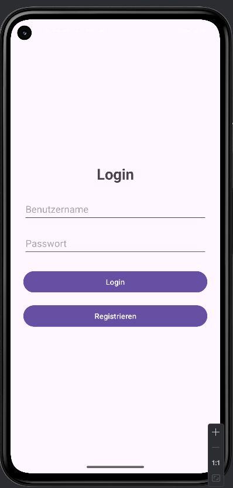
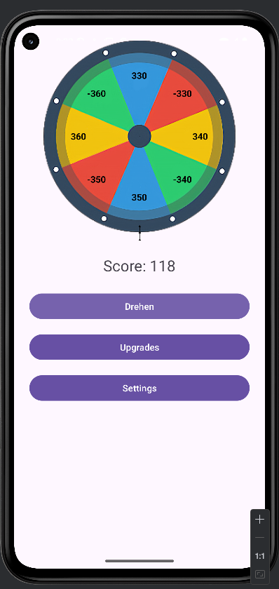
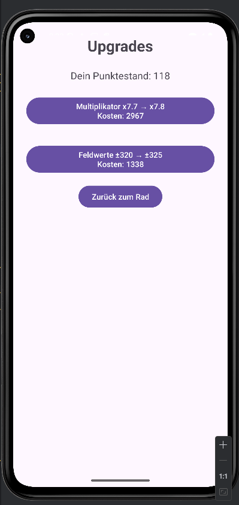

# 🎡 Glücksrad – Android-Projekt (Java, SQLite)

Ein Android-Spiel in Java, das ein Glücksrad simuliert. Spieler können durch Drehen des Rads Punkte gewinnen oder verlieren und diese Punkte anschließend für Upgrades ausgeben.

---

## 📱 Features

- 🎯 **Glücksrad mit 8 Feldern** (positive und negative Felder)
- 🔐 **Login- und Registrierungssystem**
- 💾 **Datenbankanbindung über SQLite** (Benutzerdaten, Punktestand, Upgrades)
- ⬆️ **Zwei Upgrades:**
  - **Multiplikator:** Erhöht positive Gewinne (beeinflusst nicht die negativen Felder)
  - **Feldwerte-Upgrade:** Macht alle Felder stärker (positive Felder positiver, negative negativer)
- 🛠️ **Modularer Aufbau mit DAO-Klassen**
- ⚙️ **Settings-Screen mit Netzwerkverbindungstest**
- 🎨 **Graphische Benutzeroberfläche (Java + XML)**
- 💬 **Vollständig kommentierter Code – ideal für das Verständnis**

---

## 🧱 Projektstruktur

```
Gluecksrad/
├── app/
│   ├── java/com/example/gluecksrad/
│   │   ├── database/         # DBHelper + DAO-Klassen
│   │   ├── ui/               # Activities (Login, Main, Upgrades, Settings)
│   │   └── R.java            # Ressourcen (autogeneriert)
│   └── res/                  # Layout- und UI-XML-Dateien
├── AndroidManifest.xml       # Aktivitäten, Berechtigungen etc.
└── README.md
```

---

## 🚀 Installation (lokal auf Android Studio)

1. **Projekt klonen**  
   ```bash
   git clone https://github.com/SCREWYT/Gluecksrad.git
   ```

2. **Android Studio öffnen**
   - Öffne das Projekt über `File > Open > Gluecksrad`.

3. **Emulator starten oder Handy anschließen**

4. **Build ausführen**  
   `Run > Run 'app'`

---

## 🔑 Standard-Nutzung

- **Registrierung:** Wähle einen Benutzernamen und Passwort
- **Login:** Melde dich an
- **Hauptbildschirm:** Drehe das Rad, sammle Punkte
- **Upgrades:** Gib Punkte aus für:
  - **Multiplikator:** x1.0 → x1.1 → x1.2 etc. _(wirkt nur auf positive Felder)_
  - **Feldwerte:** Erhöht positive und verstärkt negative Felder

---

## ⚙️ Technische Details

- **Sprache:** Java
- **Datenbank:** SQLite (lokal, persistente Speicherung)
- **Netzwerk:** `HttpURLConnection` zu lokalem Testserver (`http://10.0.2.2:8080/test`)
- **Min SDK:** 21 (Android 5.0+)
- **Keine Drittanbieter-Abhängigkeiten**

---

## 🛡️ Sicherheit

- **Passwörter aktuell noch im Klartext gespeichert**  
  → Hinweis: Für echte Projekte `Hashing (z.B. SHA-256)` verwenden. Sonst ist es nicht sicher.
- **Lokaler Zugriff auf SQLite – keine Serverauthentifizierung**

---

## 📊 Für die Abgabe

- ✔️ 4+ Screens: Login, Register, Main, Upgrades, Settings
- ✔️ 250+ Codezeilen
- ✔️ Datenbank mit DAO-Pattern
- ✔️ Netzwerkzugriff (`HttpURLConnection`)
- ✔️ Modularer Aufbau
- ✔️ Kommentierter Code
- ✔️ Punktelogik + Upgrades mit mathematischer Preissteigerung
- ✔️ Ablaufdiagramm

---

## 📷 Screenshots

Das sind einige Screenshots meiner App.

### 🔐 Login
[](screenshots/login_screen.png)

### 🌀 Glücksrad
[](screenshots/main_screen.png)

### 🛠️ Upgrades
[](screenshots/upgrades_screen.png)


---

### 🔐 Ablaufdiagramm
[](Final_Ablaufdiagramm_Glücksrad.png)

### 🛠️ Klassendiagramm
[](Klassendiagramm.png)


--- 

## 📄 Lizenz

Dieses Projekt wurde im Rahmen eines Kurses erstellt und dient Lernzwecken. Keine kommerzielle Nutzung.

---

## 👤 Autor

- **Name:** Görkem Istemi
- **GitHub:** [SCREWYT](https://github.com/SCREWYT)
