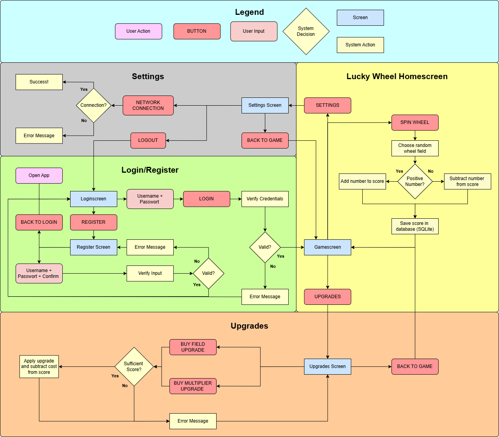

# 📊 Diagramme

Diese Seite enthält ein Ablaufdiagramm und ein Klassendiagramm zum Projekt.

---

## 🧱 Ablaufdiagramm

Das Klassendiagramm zeigt die wichtigsten Klassen und deren Beziehungen. Es bildet die Struktur des Projekts ab, einschließlich Modelle, DAOs und Aktivitäten.

---

## 🔁 Klassendiagramm

---