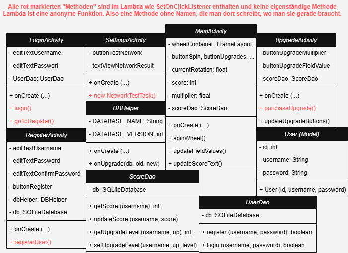

# 📊 Diagramme

Diese Seite enthält ein Ablaufdiagramm und ein Klassendiagramm zum Projekt.

---

## 🧱 Ablaufdiagramm

Das Ablaufdiagramm zeigt die wichtigsten Screens und primär die Logik.

---

## 🔁 Klassendiagramm

Das Klassendiagramm veranschaulicht die Struktur der wichtigsten Klassen der Anwendung.

---